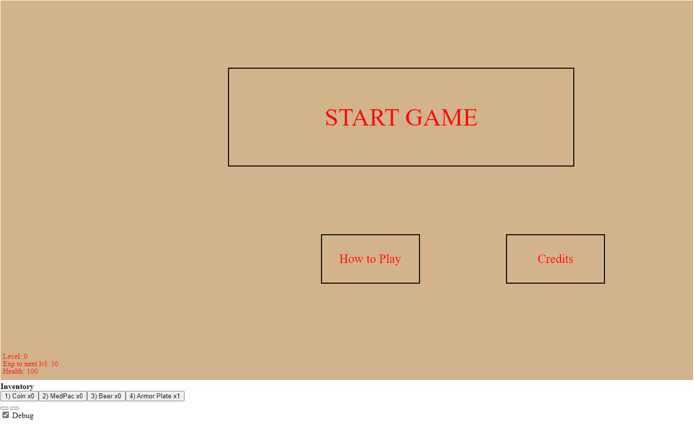
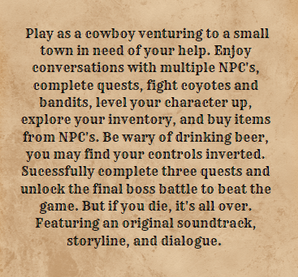
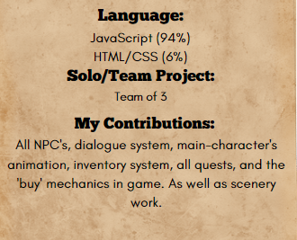
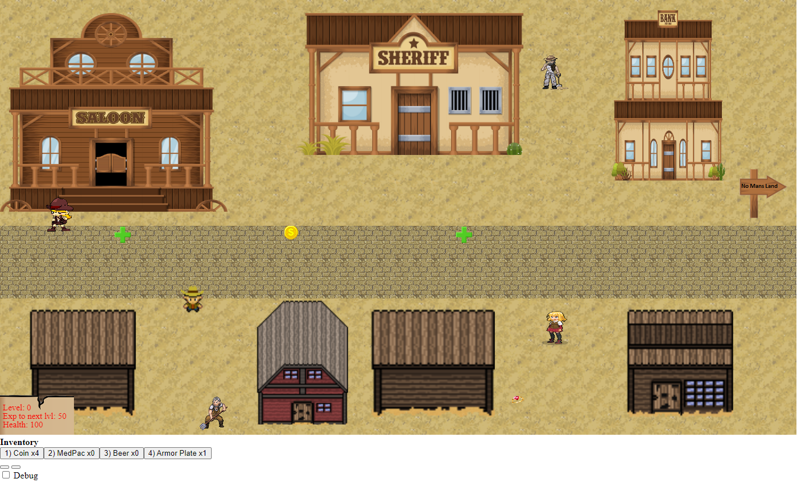
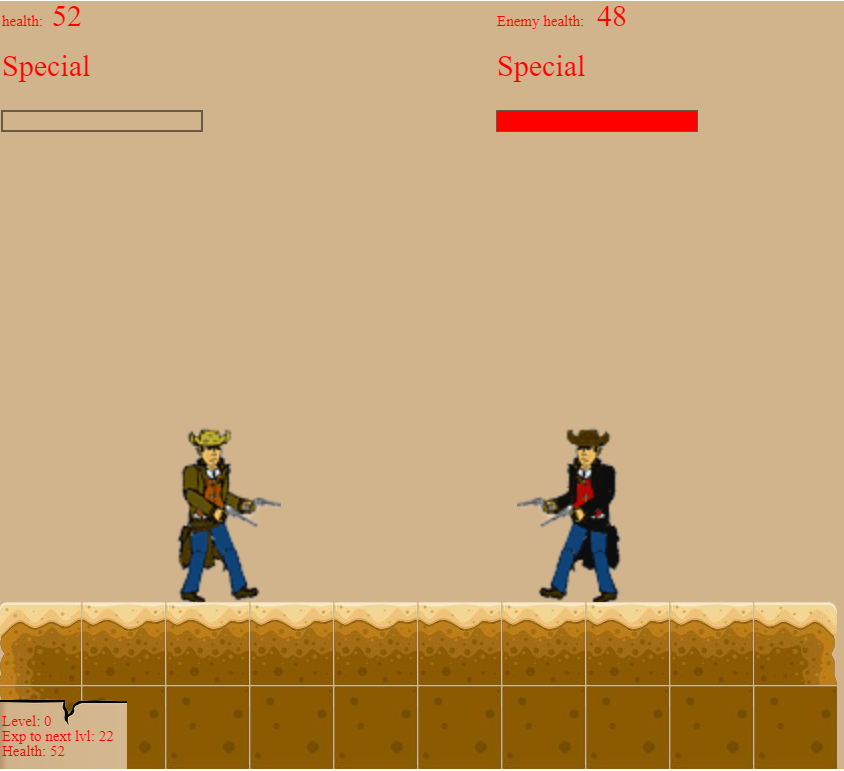
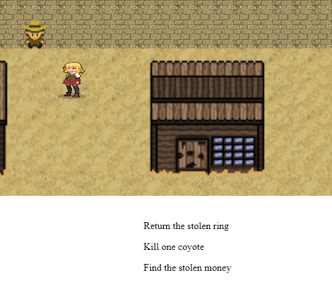
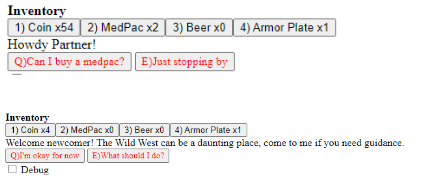
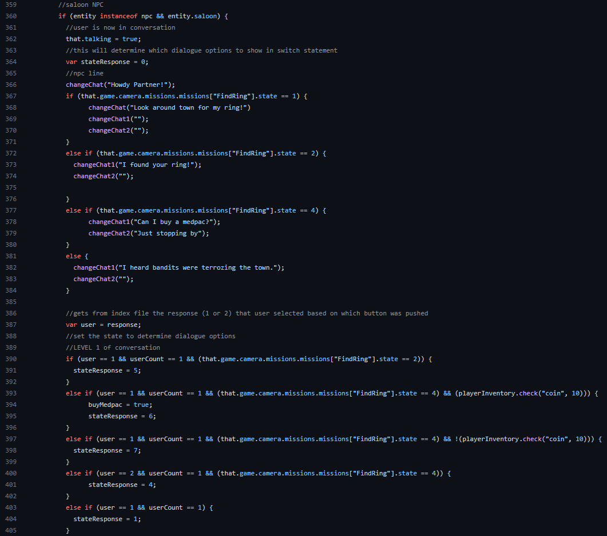
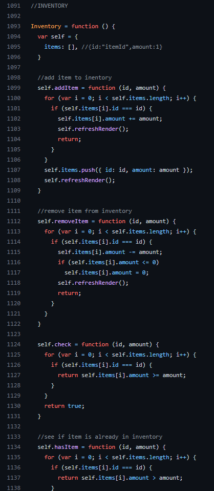
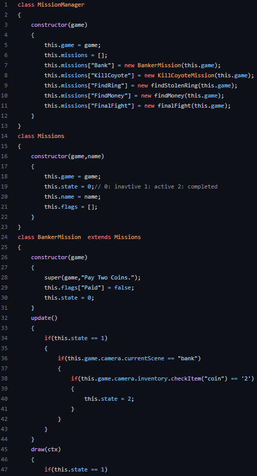

<h2>Featured Projects</h2>
<b>Cowboy RPG (2d-Browser-based)</b> &nbsp &nbsp &nbsp &nbsp &nbsp &nbsp &nbsp &nbsp &nbsp &nbsp &nbsp &nbsp &nbsp &nbsp &nbsp &nbsp &nbsp &nbsp &nbsp &nbsp &nbsp &nbsp &nbsp &nbsp <a href="https://audreyeg.github.io/CompWorlds/">Link to the playable game</a> &nbsp &nbsp &nbsp &nbsp &nbsp &nbsp &nbsp &nbsp &nbsp &nbsp &nbsp &nbsp &nbsp   
<a href="https://github.com/audreyeg/CompWorlds">Link to source code</a> 
  

 

 
 
 

Town: &nbsp &nbsp &nbsp &nbsp &nbsp &nbsp &nbsp &nbsp &nbsp  &nbsp &nbsp &nbsp  &nbsp &nbsp &nbsp  &nbsp &nbsp &nbsp  &nbsp &nbsp &nbsp  &nbsp &nbsp &nbsp &nbsp &nbsp &nbsp &nbsp &nbsp &nbsp &nbsp &nbsp &nbsp  &nbsp &nbsp &nbsp &nbsp &nbsp &nbsp &nbsp &nbsp &nbsp &nbsp &nbsp &nbsp &nbsp &nbsp &nbsp Combat: 

  

   
  

Quests: &nbsp &nbsp &nbsp &nbsp &nbsp &nbsp &nbsp &nbsp &nbsp  &nbsp &nbsp &nbsp  &nbsp &nbsp &nbsp  &nbsp &nbsp &nbsp  &nbsp &nbsp &nbsp  &nbsp &nbsp &nbsp &nbsp &nbsp &nbsp &nbsp &nbsp &nbsp &nbsp &nbsp &nbsp  &nbsp &nbsp &nbsp &nbsp &nbsp &nbsp &nbsp &nbsp &nbsp &nbsp &nbsp &nbsp &nbsp &nbsp &nbsp Inventory/Chat: 

   
  

  

<h2>Code Samples</h2>

NPC dialogue and user response options:

Inventory:

Quests:

  

**Pentago game with human player against AI**
  
Language: Java
  
Type: Solo project.
  
Skills: Min-max tree, alpha-beta pruning, predictions, game-playing, planning, and decision trees.
AI semi-intelligent and can beat human player by making optimal decisions. 
   
 <a href="https://github.com/audreyeg/EllaGainey/tree/master/PentagoGame">Link to source code</a> 
 
 **15 puzzle Solver**
   
Language: Java
  
Type: Solo project. 
   
Skills: Various algorithms such as : breadth first search, depth-first search, depth limited search, A*, and Greedy best-first search. 
   
 <a href="https://github.com/audreyeg/EllaGainey/tree/master/15Puzzle">Link to source code</a> 
